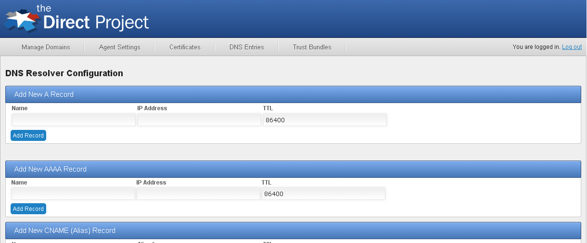

# DNS Record Configuration

The primary purpose of the DNS service is to respond to DNS queries with appropriate DNS record responses. By design, the DNS service can store any type of DNS record defined by the DNS RFC, however it is tuned only to respond to a few types of records.

The DNS service stores all DNS records in the Direct Project configurations services and accesses them over the web service interface. The the public facing DNS interface does not allow for records to be added or changed in anyway. Instead, the configuration UI tool is used to manage and maintain DNS records.

## Managing Records

The configuration UI and config management command console tools are used to add, update, and delete all record types.

**Config UI**

The Configuration UI tool is used to managed DNS records in the web UI. To managed records load the Configuration UI tool is a browser, login, and navigate to the DNS Entries tab.



**Config Management Console**

The Config Management console is command line tool for managing all configuration aspects of the DirectProject Java reference implementation including DNS records. To run the console:

1. Launch a command shell and navigate to the ConfigMgmtConsole directory.
2. Run the command *configMgr.bat*  (./configMgr for unix based systems).

The console connects to the Direct Project configuration service and manages records using the configuration service proxy module. Similar to the DNS server, the config manager uses an internal properties file to set default properties for connecting to the DirectProject configuration server.  These setting can be overridden by creating a file named *application.properties* in the ConfigMgmtConsole directory and setting the following properties:

* direct.config.service.url - The URL of the DirectProject configuration server.  Default value is  *http://localhost:8080/config-service*
* direct.webservices.security.basic.user.name: Username to authenticate to the DirectProject configuration server.  Default value is *admin*
* direct.webservices.security.basic.user.password: Password to authenticate to the DirectProject configuration server.  Default value is *d1r3ct*

##### SOA Records

The [SOA](http://support.microsoft.com/kb/163971) (start of authority) record defines (amongst other attributes) the host that is the authoritative server for a DNS zone/domain. Each domain managed by the DNS server should have a SOA record associated with it.

**Config UI**

SOA records are added by entering the required SOA record information in the Config UI tool on the DNS Resolver Configuration page.


**Management Console**

SOA records are added using either of the following commands:

* DNS&#95;SOA&#95;ADD
* DNS&#95;SOA&#95;ENSURE

```
 Add a new SOA dns record if an identical one does not exist.
    domainname primarysourcedomain responsibleemail serialnumber ttl [refresh] [retry] [expire] [minimum]
        domainname: The domain name of the name server that was the primary source for this zone
        responsibleemail: Email mailbox of the hostmaster
        serialnumber: Version number of the original copy of the zone.
        ttl: time to live in seconds, 32bit int
        [refresh]: Number of seconds before the zone should be refreshed.
        [retry]: Number of seconds before failed refresh should be retried.
        [expire]: Number of seconds before records should be expired if not refreshed
        [minimum]: Minimum TTL for this zone.
```

##### A Records

A records maps a host name to an IP4 address.

**Config UI**

A records are added by entering the required A record information in the Config UI tool on the DNS Resolver Configuration page.


**Management Console**

A records are added using either of the following commands:

* DNS&#95;ANAME&#95;ADD
* DNS&#95;ANAME&#95;ENSURE

```
 Add a new A dns record if an identical one does not exist.
    hostname ipaddress ttl
        hostname: host name for the record
        ipaddress: IP address in dot notation
        ttl: time to live in seconds, 32bit int
```

##### MX Records

MX records map a domain to one of more servers or message transfer agents for that domain. The records are returned are generally are cononical names which means they must have A or CNAME records in the DNS server.

**Config UI**

MX records are added by entering the required MX record information in the Config UI tool on the DNS Resolver Configuration page.


**Management Console**

A records are added using either of the following commands:

* DNS&#95;MX&#95;ADD
* DNS&#95;MX&#95;ENSURE

##### CERT Records

[Cert](http://tools.ietf.org/html/rfc4398) records store a certificate with a DNS name entry. The Direct Project DNS server only stores x.509 public certificates. **NOTE** The DNS server does not automatically resolve organizational level certificate resolution as defined by the security and trust specification; it only responds with the exact matches to a DNS query. The DNS client is responsibly for sending an org level query if the server does not respond with certificate to user level certificate query.

The DNS service uses the configuration services certificate store to find certificates. Certificates are added to the store using the certificates button in the configuration UI web tool. See the Gateway web deployment guide for instruction on importing certificates into the configuration UI tool. **NOTE** Even though certificates in your domain will have the private key stored with the certificates, the DNS service only returns public certificate information for CERT record queries.

## Required DNS Configuration

Typically your domain registration service will allow you to define an NS (name service) record that will point the server running your DNS service. Your DNS service is then responsible for handling all queries for your domain(s). Depending on your deployment, you will need the following minimal set of DNS records for your Direct messaging implementation:

* An SOA record for each domain managed by your server.
* An A record for each of you email servers.
* An MX record for each of you email servers server a domain.
* Either an org level certificate for each domain or individual certificates per email address (this should already be configured as part of you SMTP agent/gateway installation).

## Policy Enforcement

It is possible for multiple certificates to exist for a specific address of domain. This is especially true in circumstances when single use certificates are used (i.e. one certificate for encryption and one certificate for digital signatures). In these cases, it likely that you will not want to publish all certificates for a addresses or domains over DNS. The Direct DNS server allow you to filter published certificate using the Policy Enablement [module](https://directprojectjavari.github.io/direct-policy/).

The Direct DNS server's configuration defines a property named *direct.dns.certPolicyName*. This policy name indicates the name of the policy that the server will use for filtering certificates. If this parameter does not exist or references a policy that does not exist in the system, the server will fall back to not filtering certificates.

##### Policy Configuration

To configure a policy for certificate filtering, first define a policy using the appropriate [syntax](https://directprojectjavari.github.io/direct-policy/STextLexicon). As an example, let's say you want to only publish certificates that assert the key encipherment bit (which is probably the primary use case for using policy enforcement in the DNS server. Below is the syntax for this policy:

```
(X509.TBS.EXTENSION.KeyUsage & 32) > 0
```

Now let's say this policy is saved in a file named KeyEnc.pol. To add this policy to the system, run the Configuration Management application and execute the following sample command.

```
IMPORTPOLICY DNSCertPolicy KeyEnc.pol
```

This will create a policy named DNSCertPolicy which contains the policy defined in the file KeyEnc.pol. When the DNS server launches, it will look for a policy with the name DNSCertPolicy (assuming the *direct.dns.certPolicyName* property is set to *DNSCertPolicy*) in the system and will apply the policy to all certificates that queried.